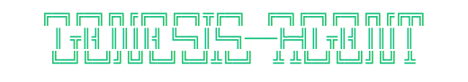
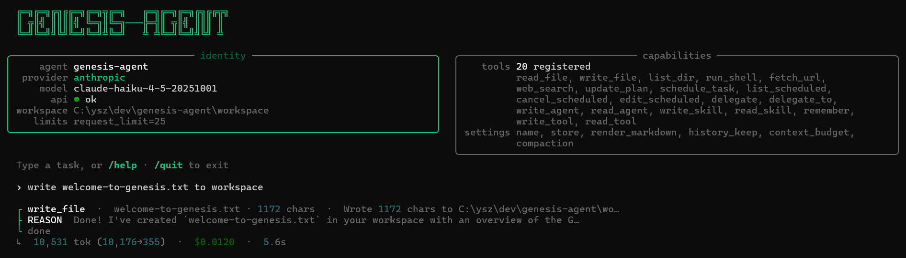
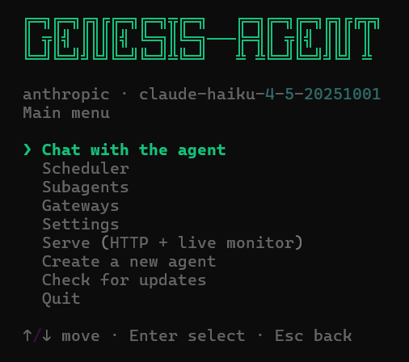

<div align="center">



**Skip the plumbing. Ship a specialized agent.**

*A lightweight, finished base for AI agents — Copy · Configure · Run → your specialized agent is ready.*


</div>

---

You want your own AI agent — a trading desk, a research bot, a support
automation. Building one from scratch isn't just plumbing; it's re-implementing
the capabilities *every* serious agent needs — model wiring, tool calling,
memory, planning, delegation, safety, deployment — before any real work begins.

**genesis-agent is that foundation, already built — and kept current with the
frontier.** A clean, lightweight base for *any* vertical agent: copy the folder,
describe the role in `persona.md`, drop your domain tools into `tools/` — done.
Everything generic is finished and stays frozen: providers (OpenAI · Anthropic ·
OpenRouter · offline Ollama), automatic tool discovery + MCP, the agent loop
with retries and usage limits, memory with auto-compaction, planning, sub-agent
delegation, a sandbox-and-approval safety layer, a live console, and
headless / Docker / cron deployment. You write only what makes your agent *yours*.

And unlike heavyweight frameworks, there's no magic to fight and little to carry:
the whole engine is ~3.8k lines of readable Python on Pydantic AI — light on
resources, small enough to read in an evening, simple enough to trust in
production.

**It runs in any environment from day one** — interactive terminal, headless
HTTP service, Docker container, or on a schedule via cron / Task Scheduler — and
a fresh copy is already a working general-purpose agent with five built-in tools:



## Quickstart

**Option 1 — one command (fastest).** Open a terminal in an **empty folder** and
paste. It downloads the project, installs `uv` + dependencies, then you launch —
**the first run walks you through provider, model, and key**, no file editing:

```powershell
# Windows (PowerShell)
irm https://raw.githubusercontent.com/ysz7/genesis-agent/main/scripts/install.ps1 | iex
.\start.cmd
```

```bash
# Linux / macOS
curl -LsSf https://raw.githubusercontent.com/ysz7/genesis-agent/main/scripts/install.sh | sh
./start.sh
```

**Option 2 — step by step.** Prefer to clone and inspect everything first:

```bash
git clone https://github.com/ysz7/genesis-agent.git
cd genesis-agent
./scripts/install.sh    # Windows: powershell -ExecutionPolicy Bypass -File scripts\install.ps1
./start.sh              # Windows: start.cmd  — first launch configures it
```

- No API key? Pick **Ollama** in the setup — fully offline, no key.
- Forked the repo? Point the installer at it with `GENESIS_REPO=...` (or edit
  `$Repo` / `REPO` in `scripts/install.*`).

## Features

- **Stands on Pydantic AI** — provider-agnostic models, native tool calling,
  retries, schema-from-type-hints. No hand-rolled transport or JSON schema.
- **Drop-in tools** — any documented, type-hinted function in `tools/*.py` is
  auto-discovered and registered. No wiring.
- **4 providers, switched via `.env`** — OpenAI · Anthropic · OpenRouter ·
  Ollama (offline, no key).
- **Live console** — reasoning tree (reason → tool → result) with a
  `tokens · cost · elapsed` footer.
- **State store** — `get/set/append/all` over JSON or SQLite for cross-run
  memory; **structured output** — return a typed Pydantic model instead of prose.
- **Conversation memory** — the REPL threads history across turns and
  auto-compacts it into a summary when a session outgrows the context budget.
- **Safe by default** — built-in file tools are workspace-sandboxed; a tool
  policy can disable or human-confirm risky tools; the HTTP server binds
  localhost and accepts an optional bearer token.
- **Bounded & tunable** — per-run usage limits (request/token caps) and model
  settings (temperature, `max_tokens`, …) straight from `settings.yaml`.
- **Built for multi-step work** — a live `update_plan` checklist and `delegate`
  to fresh, isolated sub-agents keep long tasks on track without bloating context
  (both on by default; see [Planning & delegation](#planning--delegation)).
- **Headless HTTP mode** (`--serve`, zero extra deps) with **SSE streaming**,
  **optional [MCP](https://modelcontextprotocol.io) servers**, **Docker-ready**.
- **Observable** — optional [Logfire](https://logfire.pydantic.dev) tracing, a
  local JSONL run log, and an opt-in `pydantic-evals` harness for your vertical.
- **Scales by copy** — one folder + one process per agent. 50 agents = 50 folders.

## What's installed & on by default

**The base `uv sync` installs everything needed for all core features** — memory,
compaction, planning, subagents, self-improvement, threads, guardrails, model
fallback, semantic memory, the server, multimodal, Docker/cron. Only four
**optional packages** are opt-in:

| Extra | Adds | Install |
|-------|------|---------|
| `mcp` | external [MCP](#mcp-servers-optional) tool servers | `uv sync --extra mcp` |
| `obs` | [Logfire](#observability-optional) tracing | `uv sync --extra obs` |
| `evals` | the [eval harness](#evaluating-your-vertical-optional) | `uv sync --extra evals` |
| `pg` | the [Postgres + pgvector example](examples/pg_support/) | `uv sync --extra pg` |

Behaviourally, a **fresh copy ships with the "agentic" capabilities on** and
everything that costs money/latency or changes a contract **off** (one line to
enable). Every `settings.yaml` key:

| Setting | What it does | Default |
|---------|--------------|---------|
| `name` | display name | ✅ on (folder name) |
| `store` | cross-run state file (JSON / SQLite) | ✅ on (`state.json`) |
| `workspace` | sandbox + state directory | ✅ on (`workspace`) |
| `history_keep` | REPL turns kept between prompts | ✅ on (`40`) |
| `threads` | persist / resume conversations by id | ⬜ off |
| `context_budget` | usable context window; compaction trigger | ✅ on (`100000`) |
| `compaction` | summarize old history past the budget | ✅ on |
| `max_tool_output` | char cap on one tool's output | ✅ on (`20000`) |
| `limits` | per-run request / token ceilings | ✅ on (`request_limit 25`) |
| `retries` | retries per failed tool / model call | ✅ on (`2`) |
| `model_settings` | `temperature` / `max_tokens` / `timeout` | ⬜ off (provider defaults) |
| `model_fallbacks` | backup models retried on a transient failure | ⬜ off |
| `sandbox` | confine file tools to `workspace/` | ✅ on (code default `true`) |
| `tools` | `disable` / `confirm` tool policy | ⬜ off (no policy) |
| `guardrails` | regex `input` / `output` `block` / `redact` | ⬜ off |
| `serve_timeout` | per-task wall-clock for `--serve` (→ 504) | ✅ on (`300`) |
| `prompt_caching` | reuse the provider's prompt cache | ⬜ off |
| `attachments` | image / PDF input (multimodal); `max_mb` caps size | ✅ on (cap `10`MB) |
| `planning` | `update_plan` todo scratchpad | ✅ on |
| `subagents` | `delegate` / `delegate_to` + named-agent authoring | ✅ on |
| `self_improvement` | author skills / tools / lessons (tools need approval) | ✅ on |
| `memory_recall` | recent lessons injected into the prompt | ✅ on (`5`) |
| `generated_tools` | generated-tool timeout / banned imports | ✅ on (defaults) |
| `approvals` | headless: honor persisted "always allow" grants | ⬜ off (deny) |
| `memory` | `semantic: true` → relevance recall via embeddings | ⬜ off (recency) |
| `mcp` | external MCP tool servers (also needs `--extra mcp`) | ⬜ off |

Legend: ✅ active out of the box · ⬜ opt-in (commented out in the template).

## Usage

**`start.cmd`** / **`./start.sh`** opens an arrow-key start menu: Chat ·
Scheduler · Settings · Serve · Quit. The launchers find `uv` and auto-install
deps on first run.



Pass a task or flags to skip the menu:

```bash
start.cmd "Summarize the README in three bullets"   # one-shot
start.cmd --serve                                    # HTTP service
```

From a terminal, run `uv` **inside the agent folder** — `.env` / `persona.md` /
`settings.yaml` are loaded from the current directory (use `--root path/to/agent`
from elsewhere):

```bash
uv run agent "Summarize the README in three bullets"   # one-shot
uv run agent                                            # interactive REPL
uv run agent --serve --port 8181                        # HTTP service
```

In the **REPL**, type a task or a command: `/help` · `/tools` · `/clear`
(forget the conversation) · `/reload` (pick up newly approved tools) · `/quit`.
With **persistent threads** on (`threads.enabled`), `agent --session work`
resumes a saved conversation, and `/threads` · `/resume <id>` · `/new` manage
them — a thread survives a restart (see [Configuration](#configuration)).

The **HTTP server** binds `127.0.0.1` (localhost only) by default — pass
`--host 0.0.0.0` to accept remote connections (the Docker image does this). Set
`SERVER_TOKEN` in `.env` to require `Authorization: Bearer <token>` on every
endpoint except `/health`.

```bash
# one-shot JSON
curl -X POST localhost:8181/task -H "content-type: application/json" \
     -d '{"task": "what files are in the workspace?"}'

# with a bearer token (when SERVER_TOKEN is set)
curl -X POST localhost:8181/task -H "Authorization: Bearer $SERVER_TOKEN" \
     -H "content-type: application/json" -d '{"task": "hi"}'

# stream the run as Server-Sent Events (text / tool / tool_result / done frames)
curl -N "localhost:8181/task/stream?q=list+the+files+here"
```

Endpoints: `POST /task` · `GET /task?q=...` (browser-friendly) ·
`GET /task/stream?q=...` (SSE) · `GET /health` (open, no auth).

Each request is **stateless by default**. With `threads.enabled`, a caller can
pass `POST {"task": ..., "session": "<id>"}` to carry a conversation across
requests (loaded and saved per `session_id`); omit `session` and it stays
stateless.

**Multimodal input** (vision-capable models): attach images/PDFs with
`uv run agent "what's this?" --image photo.png`, by dragging a file into the
REPL, or via `POST /task` with `{"task": ..., "images": ["https://..."]}` (the
server accepts URLs only). A non-vision model degrades with a clear message.

## Make a vertical agent

Run the wizard: **`scripts/new-agent.cmd`** / **`./scripts/new-agent.sh`** (or
*Create a new agent* in the menu). Enter name, role, provider, model, key — it
scaffolds a ready-to-run agent in a sibling folder `../<name>` with a generated
`persona.md` / `settings.yaml` / `.env` and a copy of the engine.

Then refine it:

1. Edit **`persona.md`** — the system prompt.
2. Drop domain tools into **`tools/`** — one documented, type-hinted function
   per tool; take `ctx: RunContext[AgentDeps]` as the first parameter to reach
   the http client / store / settings.
3. Run **`start.cmd`** / `./start.sh`.

Filled-in verticals to copy from:
- [`examples/rss_research/`](examples/rss_research/) — drop-in tool,
  settings-driven feeds, store-based dedup, structured output.
- [`examples/pg_support/`](examples/pg_support/) — a real **Postgres + pgvector**
  database (relational tickets *and* vector knowledge base in one instance),
  wired in with zero engine changes.

## Configuration

Non-secret config lives in **`settings.yaml`** (loaded into `deps.settings`);
secrets live in **`.env`**. Every key below ships commented in the template
files with the same notes — this is just the consolidated reference.

**`.env`** (secrets):

| Key            | Purpose |
|----------------|---------|
| `PROVIDER` · `MODEL` · `API_KEY` · `BASE_URL` | model selection (see [Providers](#providers)) |
| `SERVER_TOKEN` | optional `--serve` bearer token; unset = no auth |
| `LOGFIRE_TOKEN` | enables Logfire tracing when `--extra obs` is installed |

**`settings.yaml`** (non-secret):

| Key | Default | What it does |
|-----|---------|--------------|
| `name` | folder name | display name |
| `store` | `state.json` | state file in `workspace/` (`*.json` or `*.db` SQLite) |
| `retries` | `2` | Pydantic AI retries per failed tool/model call |
| `max_tool_output` | `20000` | char cap on a tool's output (`run_shell`, `fetch_url`, HTML cleaner) |
| `history_keep` | `40` | REPL messages kept between turns |
| `threads` | — | `enabled: true` → persist/resume conversations by `session_id` (REPL `--session`; server `{"session": ...}`) |
| `context_budget` | `100000` | model's usable context (tokens); compaction triggers at ~60% |
| `compaction` | `enabled: true, keep: 12` | summarize old history past the budget |
| `limits` | `request_limit: 25` | per-run ceilings (`pydantic_ai.usage.UsageLimits`) |
| `model_settings` | — | `temperature`, `max_tokens`, `timeout`, … passed to the model |
| `model_fallbacks` | — | backup model ids (same provider) retried on a transient primary failure |
| `sandbox` | `true` | confine file tools to `workspace/`; `false` to allow any path |
| `tools` | — | `disable: [...]` (never registered) · `confirm: [...]` (human y/N) |
| `guardrails` | — | regex `input`/`output` `block`/`redact` — a content layer over the tool policy |
| `serve_timeout` | `300` | per-task wall-clock seconds for `--serve` → `504` |
| `log_runs` | `false` | append one JSON line per run to `workspace/runs.jsonl` |
| `attachments` | `max_mb: 10` | per-image/PDF size cap for multimodal input |
| `prompt_caching` | `false` | reuse the provider's prompt cache (Anthropic: tool defs) |
| `planning` | `enabled: true` | `update_plan` todo checklist, shown each turn ([§](#planning--delegation)) |
| `subagents` | `enabled: true` | `delegate(task)` to isolated sub-agents; `max_depth` caps nesting ([§](#planning--delegation)) |
| `self_improvement` | `enabled: true` | agent authors skills / tools / memory ([§](#self-improvement-optional)) |
| `mcp` | — | external [MCP](#mcp-servers-optional) servers |

The tool policy is the key safety lever: `fetch_url` content is
attacker-controlled (prompt injection), so an unconfirmed `run_shell` is an
injection-to-RCE chain — `confirm: [run_shell]` or `disable: [run_shell]` when
inputs are untrusted. (Headless `--serve` has no human, so a confirm-listed
tool refuses to run rather than executing unattended.)

Built-in `fetch_url` returns HTML as readable text (tags stripped, links
rendered as `text (href)`); pass `raw=True` for the untouched markup.

## Providers

| `PROVIDER`   | `MODEL` example                | API key | Notes |
|--------------|--------------------------------|---------|-------|
| `openai`     | `gpt-4o-mini`                  | ✓       | |
| `anthropic`  | `claude-haiku-4-5`             | ✓       | |
| `openrouter` | `openai/gpt-oss-120b:free`     | ✓       | `BASE_URL` auto-set |
| `ollama`     | `llama3.1:8b`                  | ✗       | offline, no key needed |

Switching is a `.env` edit — no code changes.

### Running on local models (Ollama)

Local models work, with two gotchas:

- **The context trap.** Ollama silently truncates context to its default
  `num_ctx` (~4k) *regardless of what the model supports* — the agent "goes
  dumb" with no error. Raise it (`OLLAMA_CONTEXT_LENGTH=32768`, or a model
  `num_ctx`) **and** set `context_budget` in `settings.yaml` to match, so
  compaction triggers before Ollama starts dropping your prompt.
- **Small-context profile.** On a tight budget, shrink tool output and the
  budget and disable heavy tools:

  ```yaml
  # settings.yaml — for an 8k-context local model
  context_budget: 6000
  max_tool_output: 3000
  tools:
    disable: [run_shell]     # keep the model focused; re-enable as needed
  ```

- **Model choice.** Use a model trained for tool calling — `qwen2.5` 7B+ is a
  reliable floor; expect flaky tool/structured output below ~7B. These hints
  are mirrored in `settings.yaml` comments for first-time users.

## MCP servers (optional)

```bash
uv sync --extra mcp
```

```yaml
# settings.yaml
mcp:
  - name: demo
    command: python
    args: ["examples/mcp_demo/echo_server.py"]   # local stdio server
  - name: docs
    url: https://example.com/mcp                  # remote server
```

Their tools appear to the agent like built-ins (prefixed with `name`). Demo:
[`examples/mcp_demo/`](examples/mcp_demo/). Without an `mcp:` block nothing changes.

## Observability (optional)

Two independent, opt-in layers — the core never imports either, so default
runs are unchanged:

- **Logfire tracing:** `uv sync --extra obs`, then set `LOGFIRE_TOKEN` in
  `.env`. Every model and tool call is traced. Absent the token it degrades
  silently.
- **Local run log:** `log_runs: true` in `settings.yaml` appends one JSON line
  per run (task, duration, tokens, ok/err) to `workspace/runs.jsonl` — greppable
  history, zero external services.

## Evaluating your vertical (optional)

Score your agent against golden tasks with [pydantic-evals](https://ai.pydantic.dev/evals/):

```bash
uv sync --extra evals
uv run python evals/example_eval.py
```

[`evals/example_eval.py`](evals/example_eval.py) is a copyable template — a tiny
`Dataset` of cases scored by a plain (no-second-model) `Contains` check, run
against the live agent. Swap in your own cases and evaluators. The core never
imports `pydantic_evals`.

## Planning & delegation

Two agentic capabilities, shipped **on by default** (set `enabled: false` to opt
out):

- **Planning** (`planning`) — `update_plan(steps)` gives the agent a visible todo
  checklist it keeps current across turns. The plan is injected into the system
  prompt each turn and rendered in the console as a `○ / ▸ / ✓` tree. It's a
  scratchpad, not enforced control flow — cheap, and worth it on any multi-step
  task.
- **Subagents / delegation** (`subagents`) — `delegate(task)` runs a fresh
  sub-agent on an isolated subtask (clean context, no message history) and returns
  just its final answer, so the parent's context stays lean. Use it for focused
  lookups or to split a big job into parts (call it several times). Sub-agents
  share state (store / workspace / http) but **not** history, never receive
  `write_tool`, and their token cost folds into the parent's usage budget so
  limits stay honest. `max_depth` (default `1`) caps nesting — the top agent may
  delegate, sub-agents may not, so there are no runaway fork-bombs.

**Named, specialized subagents.** Beyond the anonymous `delegate`, you can give
the agent a roster of named specialists — each its own persona and tool allowance
— and it picks the right one by description with `delegate_to(name, task)`. A
subagent is a markdown file, `workspace/agents/<name>.md`:

```markdown
---
description: Researches a topic from primary sources and returns a 3-bullet brief.
tools:
  allow: [fetch_url, read_file, write_file]   # omit to inherit the parent's tools
model: gpt-4o-mini                            # optional — same provider, cheaper/stronger model
---
You are a meticulous research sub-agent. Fetch primary sources, cross-check, and
return a tight brief with links.
```

There are three ways one comes to exist, all the same file: the **agent authors
one itself** mid-task, **you ask it to** in chat ("make me a code-reviewer
agent"), or **you write the file by hand**. The first two use `write_agent`
(gated by `subagents.allow_authoring`, on by default) — markdown only: creating
a new subagent is free, like `write_skill`, while **improving an existing one
asks for approval** (once · always · deny) so a relied-upon specialist isn't
silently changed. The roster is shown in the start menu's
**Subagents** screen and injected into the agent's prompt so it knows who it can
delegate to. A subagent's `tools.allow` / `deny` can only *narrow* the parent's
policy, never widen it; an optional `model:` routes it to a different model id on
the same provider (e.g. a cheap model for a simple specialist).

```yaml
# settings.yaml
planning:
  enabled: true
subagents:
  enabled: true
  max_depth: 1            # how deep delegation may nest
  allow_authoring: true   # false = fixed, human-curated roster (agent can't write_agent)
```

## Self-improvement (optional)

**On by default** — the agent gets tools to extend itself, all sandboxed to
`workspace/`. Self-authored *tools* still never run until a human approves them
(below), so the safety boundary holds; set `enabled: false` to remove the
authoring tools entirely.

```yaml
# settings.yaml
self_improvement:
  enabled: true     # set false to opt out
```

- **Skills** (the primary path) — `write_skill` / `read_skill` save reusable
  procedures as markdown under `workspace/skills/`. Not code, so no approval; a
  one-line index is injected into the system prompt and pulled in full on demand.
- **Memory** — `remember(lesson)` appends to `workspace/memory/lessons.jsonl`; a
  digest of recent lessons rides in the system prompt next session. With
  `memory.semantic` on, lessons are recalled by **relevance** to the current task
  (embedding + cosine, no vector DB) instead of recency — degrades to recency on
  any embedding failure.
- **Tools** — `write_tool` authors a Python tool under `workspace/tools/`. It
  runs **only** after passing checks (syntax → banned-import scan → load + tool
  contract) **and** a human approval. Approvals are three-way (once · always ·
  deny); an "always" grant persists in `workspace/approvals.json` keyed by a hash
  of the code, so editing the file re-triggers approval. In the REPL, `/reload`
  (or automatic reload after approval) makes a new tool callable in the same
  session. Headless `--serve` has no human, so activation is denied unless
  `approvals.headless_allow_granted` honors a prior grant.

To **improve** an existing skill or tool, the agent reads it (`read_skill` /
`read_tool`), revises, and saves under the same name — `write_skill` /
`write_tool` overwrite, and a changed tool re-runs validation and approval.

The human approval — not the validation — is the security boundary; generated
files carry a provenance header (when, prompting task, model) for auditability.

## Docker

```bash
cp .env.example .env
docker compose up --build      # serves POST /task on :8181
```

`workspace/` is mounted as a volume, so state persists. One-shot:
`docker run --rm --env-file .env genesis-agent uv run agent "your task"`.

Inside the container the server binds `0.0.0.0` (the image's `CMD` passes
`--host 0.0.0.0`) so the published port is reachable — the host `-p` mapping is
the real boundary. Set `SERVER_TOKEN` in `.env` to require bearer auth when the
port is exposed beyond localhost.

## Scheduling

**In-app** — the *Scheduler* menu item runs recurring tasks in a live feed.
Jobs persist in the state store but fire only while the scheduler is open.

**External (24/7)** — drive one-shot runs with cron / systemd / Task Scheduler
via `scripts/run.sh` / `scripts/run.ps1` (not `start.cmd` — it ends with
`pause`). Templates: [`schedule.example`](schedule.example).

```bash
# cron — every hour
0 * * * * /path/to/agent/scripts/run.sh "Run the hourly briefing" >> /path/to/agent/workspace/cron.log 2>&1
```

```powershell
# Windows Task Scheduler — daily at 9am
$root    = "C:\path\to\agent"
$action  = New-ScheduledTaskAction -Execute "powershell.exe" `
    -Argument "-NoProfile -ExecutionPolicy Bypass -File `"$root\scripts\run.ps1`" `"Run the hourly briefing`""
$trigger = New-ScheduledTaskTrigger -Daily -At 9am
Register-ScheduledTask -TaskName "genesis-agent" -Action $action -Trigger $trigger
```

## Project structure

```
genesis-agent/
├── agent/                  the frozen engine (never edited per vertical)
│   ├── __main__.py         entrypoint: menu · one-shot · REPL · --serve
│   ├── __init__.py         public API: `from agent import AgentDeps, parse_rss`
│   ├── runtime/            config · context (AgentDeps) · store · runlog · approvals
│   ├── engine/             model · registry · factory · mcp · compaction · runner
│   ├── tools/              builtins · toolkit (http/cache/rss/html) · selfimprove
│   ├── console/            display (rich tree · spinner · stats) · menu
│   └── server/             stdlib HTTP: POST /task · SSE /task/stream · live monitor
├── persona.md              the vertical's system prompt          ← yours
├── settings.yaml           non-secret config (feeds, mcp, …)     ← yours
├── .env                    secrets (provider, model, key)        ← yours
├── tools/                  drop-in custom tools (auto-discovered) ← yours
├── workspace/              runtime sandbox (created on first run):
│   ├── files/              task outputs (write_file default)
│   ├── tools/ · skills/    agent-authored, approved tools + skills (opt-in)
│   ├── agents/             named subagent definitions (markdown)
│   └── memory/             reflection lessons
├── examples/               filled-in verticals to copy from
├── evals/                  copyable pydantic-evals harness (opt-in)
├── scripts/                install · run · fleet · new-agent helpers
├── start.cmd / start.sh    double-click launchers (start menu)
└── Dockerfile · docker-compose.yml
```

## Changelog

Notable changes per release are in [CHANGELOG.md](CHANGELOG.md). If you copied
this template, compare it against upstream to see what changed since your copy —
some releases change defaults (e.g. the server now binds localhost), so skim the
**Security** / **Changed** notes before syncing.

## License

MIT — see [LICENSE](LICENSE).
